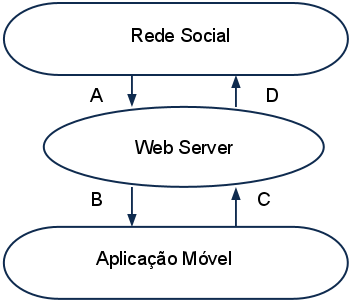

Integração com as Redes Sociais
===============================

A solução é composta basicamente por três partes:

- aplicação cliente: se comunicará com a rede social através de um web server funcionando como um proxy para enviar e obter informações de contexto;
- web server: responsável por filtrar as informações sobre usuário obtidas das redes sociais de forma a minimizar a quantidade de dados transmitida e também por fazer a interface com estas redes de tal forma que não seja necessário o cliente conhecer seus padrões e protocolos;
- aplicativo social: será executado na rede social (i.e. Facebook) e será o destino final das informações enviadas pelo aplicativo móvel. Um exemplo prático seria uma aplicação no Facebook na qual o usuário veria em um mapa a posição de cada um de seus amigos e um texto de atualização de perfill com o comentário  ("Está trânsito") que eles deixaram ao passar naquela posição ("Túnel da PUC"). Neste caso, o resultado final seria um mapa com o tráfego próximo ao usuário.

O servidor web possui um serviço de descoberta de novas redes sociais de forma que, quando o usuário se conecta, a aplicação Android configura cada uma das redes disponíveis. O Servidor filtrará as informações necessárias, diminuindo o tráfego de dados entre o dispositivo móvel e o proxy e possuirá alguma inteligência para agrupar informações.

A figura abaixo descreve, de modo geral, a arquitetura proposta:

O servidor web obtém as informações de contexto e os contatos dos usuários na rede social (A) e repassa de forma otimizada para a aplicação (B). A aplicação envia informações de contexto para o servidor (C), responsável por distribuir as informações nas redes sociais disponíveis (D).
