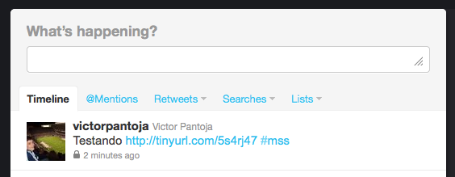

API de Envio de Contexto
========================
Exibe as informações de Contexto Enviadas pelos Usuários de Forma Integrada ao Facebook
---------------------------------------------------------------------------------------

.. code-block:: python

	(r"/canvas/", CanvasHandler),

Serviço que retorna uma página com as informações de contexto enviadas pelos usuários 

Parâmetros: Nenhum

Retorno:
	Página HTML Integrada ao Google Maps exibindo as informações de contexto enviadas pelos usuários e sua posição.

Exibe as informações de Contexto Enviadas pelos Usuários
--------------------------------------------------------

.. code-block:: python

	(r"/webview/", WebViewHandler),

Serviço que retorna uma página com as informações de contexto enviadas pelos usuários 

Parâmetros:
	* auth: string de autenticação do usuário no MSS

Retorno:
	Página HTML Integrada ao Google Maps exibindo as informações de contexto enviadas pelos usuários e sua posição.

Recebe o contexto enviado por um usuário e distribui pelas redes sociais
------------------------------------------------------------------------

.. code-block:: python

	(r"/context", ContextHandler),

Serviço que recebe o contexto enviado por um usuário e distribui pelas redes sociais selecionadas.

A posição do usuário será enviada para as redes sociais na forma de uma URL encurtada do Google Maps. A figura abaixo exemplifica essa ação:

Parâmetros:
	* auth: string de autenticação do usuário no MSS

Retorno:
	JSON com Status da Ação e Cópia da Mensagem Enviada para as Redes Sociais

Obter o status do sistema
-------------------------

.. code-block:: python

	(r"/status", StatusHandler),

Serviço que retorna uma página com uma mensagem aos usuários e servir de canal de comunicação entre o administrador do sistema e o usuário.

Parâmetros:
	* auth: string de autenticação do usuário no MSS

Retorno:
	HTML com a informação cadastrada pelo adminstrador.
